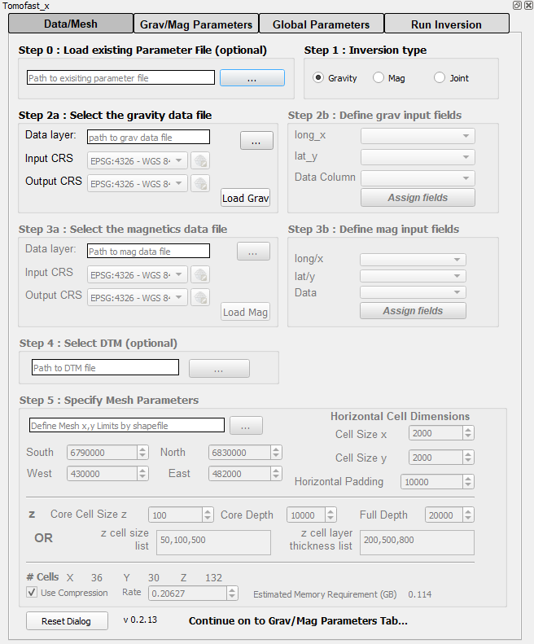
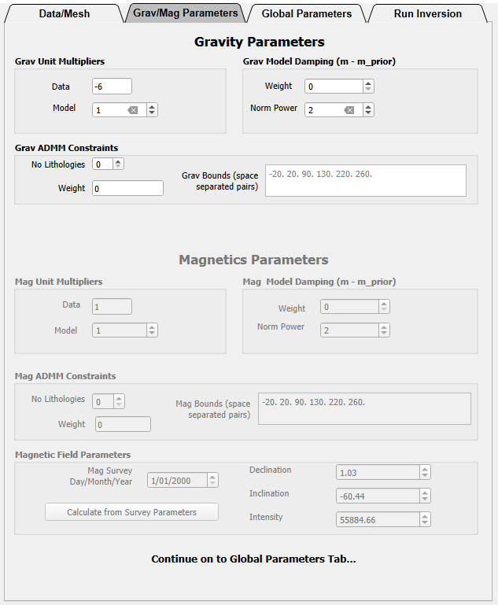
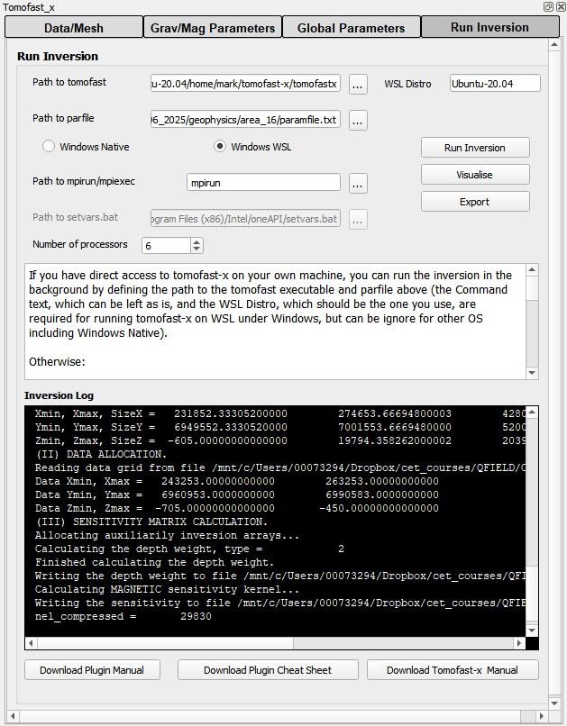

# Tomofast-x QGIS and ArcGIS Pro Plugin v0.2.15
 GIS Plugin to help Tomofast-x usage

 **<a href="https://tectonique.net/tomofast-x-q/Tomofast-x-q%20cheat%20sheet.pdf">Cheat Sheet</a>&nbsp;&nbsp;&nbsp; |&nbsp;&nbsp;&nbsp;<a href="https://tectonique.net/tomofast-x-q/Tomofast-x-q%20User%20Manual.pdf">Download Basic Help Document</a>**&nbsp;&nbsp;&nbsp; |&nbsp;&nbsp;&nbsp;<a href="https://tectonique.net/tomofast-x-q/tomofast_demo.mp4">Ctrl-click on link to watch demo video</a>**

## Recent changes
changelog=0.2.15 First Beta of ArcGIS Pro Toolbox   
    0.2.14   
    * Allow tiff and tif suffix inputs for DTM   
    * Remove Upload_plugin.py script   
    * Fix untested path usage   
    * Add link to new help page and update video to latest GUI  
    * Split run_inversion into os-specific codes    
    * Full load of data layers when loading old parfile  
    * Add built-in display of tomofast output to plugin GUI   
    * Extract profile and create 2D inversion files   
    * Add translations for French, Spanish, Portuguese, Brazilian Portuguese and Mandarin   
    0.2.13   
    * Update calls for newer pandas compatibility   
    * Increase max depths for mesh generation   
    * Update requirements   
    * Fix IGRF calc   
    * Fix joint inversion workflow   
    * Add multiple z cell thicknesses   
    0.2.12   
    * Allow simpler Windows runtime install   
    0.2.11   
    * Add support for Native Windows tomofast-x    
    * remove data field from mesh file   
    * minor GUI reorganisation   
    0.2.10   
    * Remove pre command widget for WSL (no longer needed)    
    * Allow Linux definition of mpirun path   
    * Allow outputs to be stored on linux drive   
    * Compatibility with both QGIS4/QT6 and QGIS3/QT5  
    0.2.9   
    * Add export to csv option
 
    
## QGIS Plugin Install
Use QGIS Plugin Manager in QGIS 3.xx to load directly the Plugin Repository (experimental) or download the zip file of this repository (QT6 branch) and use Install in QGIS 3.xx or QGIS 4.xx from Zip file in the QGIS Plugin Manager.   

## ArcGIS Pro: THIS IS VERY BETA!!!
1) Download and unzip this respository and store somewhere safe.
2) In order to run python code in ARCGIS Pro you will need to manually add some python libraries so SGTool has everything it needs:
- a) Open Package Manager: Click the Project tab on the ribbon and select Package Manager from the side menu. Access Environment Manager (Gear icon to right of active environemnt): 
  - i) Click the Environment Manager button (top right) to open the management dialog.
  - ii) Clone the Environment: Locate the environment you wish to copy (usually arcgispro-py3) and click the Clone button next to it.
  - iii) Set Destination: In the Clone Environment dialog, provide a name and path for your new environment or leave it as the default.
  - iv) Finalize: Click OK. The cloning process may take several minutes.
- b) Once the cloned environment has been created, search for and install the following packages, **if they are not already installed**:
  - pandas
- c) In the ArcGIS Pro Catalogue area, go to Add toolbox and select the file **Tomofast_X.pyt** in the **ARCGIS** directory in this repository. 
- d) Double click on the new **Tomofast_X.pyt** Toolbox to get the list of functions that can be run, and select  **Open Tomofast-x Panel** then **run** to launch the Tomofast_x_q GUI.     

## Tomofast-x Install
To use this plugin to its full potential you may want to install Tomofast-x itself on the same computer on which you are running QGIS.

See the [Installation instructions](https://github.com/TOMOFAST/Tomofast-manual/blob/main/install.md) for detailed installation instructions.

## Simple instructions

**Tooltips in plugin provide parameter name used in paramfile in squre brackets to help with subsequent manual editing**   
   
**Select tomofast-x-q plugin and Select Data/Mesh tab**   
    
A. Optionally pre-load an existing paramfile from disk [Step 0]      
B. Select Grav, mag or both Inversion stype [Step 1]   
C. Select a data layer (csv or tif format), define input and output projections, and Load data [Step 2a or Step 3a]   
D. If csv data, select fields for lat_x, long_y & data [Step 2b or Step 3b, data loaded to QGIS once Assign fields button selected]   
E. Select DTM tif file or use constant value [Step 4 reprojected dtm loaded to QGIS]   
F. Specify mesh parameters (optionally defined from max/min x,y extents of a polygon shapefile, or define a 2D section with a straight line polyline shapefile). Check Model Grid Size to make sure the mesh is not stupidly large. z cell parameters can either be defined as a two layer system (with finer cells in the upper layer then progressively coarser cells beneath that) or as a multi z cell system (with comma separated lists of cell size and layer thicknesses, with the latter being multiples of the equivalent cell size)   
G. Define compression amount. Check the Estimated Memory Requirements to make sure you run the inversion on a computer with enough memory.    
    
**Select Grav/Mag Parameters tab**   
    
H. For mag survey autofill (using centroid of mesh) or define Magnetic Field parameters   
   
**Select Global Parameters tab**   
     
I. Specify Global Inversion parameters   
J. Modify parameters and then save out  File by clicking on Save Files button [Data and Parameter file written out]  
K. Define output directory and mesh and data files will then be written out and loaded to QGIS     
 
   
**Run tomofast-x from plugin using the just-generated files**   
    
L. If you have tomofast-x installed on your machine, you can run it directly from this tab, after defining the path to the tomofastx executable and the paramfile, and the number of processors to use.    
   
Under Windows this can be run as a native tomofastx.exe file or via WSL2 (Windows Subsystem For Linux v2), so you will need to specify which type of Windows you will run and:
- For **Native Windows** use you will need to specify the path to a bat file called **setvars.bat** and **mpiexec.exe** (tooltips give likely locations)
- For **WSL** which Linux Distribution is installed in the **WSL Distro** text area and type in **mpirun** in the **Path to mpirun/mpiexec** text area
- For **MacOs** use you will have to specify the path to the OpenMPI mpirun binary
   
Otherwise copy these files to another machine and run tomofast-x there (but you will have to fix the paths in the **paramfile.txt** file first)    
- **data_magn.csv and/or data_grav.csv**: observed geophysical response   
- **model_grid.txt**: Model mesh   
- **paramfile.txt**: parameter definition file   

## Credits    
Plugin construction - Mark Jessell using QGIS Plugin Builder Plugin and code from Vitaliy Ogarko   
Tomofast-x - Vitaliy Ogarko   
IGRF calculation - https://github.com/klaundal/ppigrf  
