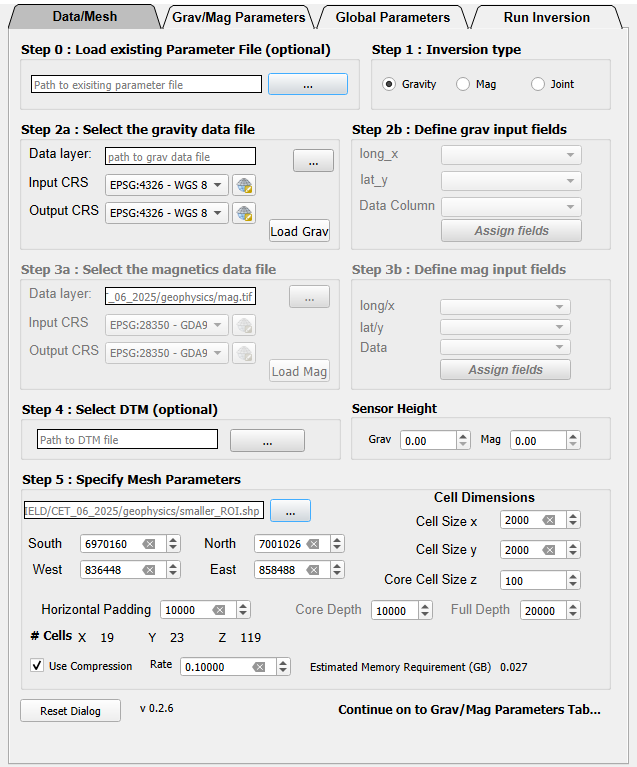
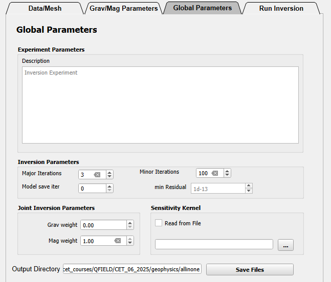
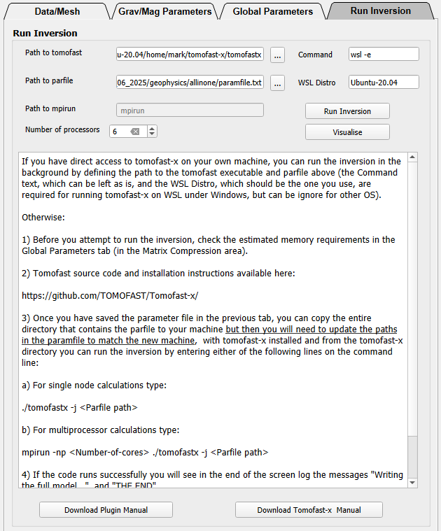

# Tomofast-x QGIS Plugin
 QGIS Plugin to help Tomofast-x usage

 **<a href="https://tectonique.net/tomofast-x-q/Tomofast-x-q%20cheat%20sheet.pdf">Cheat Sheet</a>&nbsp;&nbsp;&nbsp; |&nbsp;&nbsp;&nbsp;<a href="https://tectonique.net/tomofast-x-q/Tomofast-x-q%20User%20Manual.pdf">Download Basic Help Document</a>**&nbsp;&nbsp;&nbsp; |&nbsp;&nbsp;&nbsp;<a href="https://tectonique.net/tomofast-x-q/tomofast_demo.mp4">Ctrl-click on link to watch demo video</a>**

## Recent changes
changelog=0.2.11   
    * Add support for Native Windows tomofast-x    
    * remove data field from mesh file   
    * minor GUI reorganisation   
    0.2.10   
    * Remove pre command widget for WSL (no longer needed)    
    * Allow Linux definition of mpirun path   
    * Allow outputs to be stored on linux drive   
    * Compatibility with both QGIS4/QT6 and QGIS3/QT5  
    0.2.9   
    * Add export to csv option
 
    
## Plugin Install
Use QGIS Plugin Manager in QGIS 3.xx to load directly the Plugin Repository (experimental) or download the zip file of this repository (QT6 branch) and use Install in QGIS 3.xx or QGIS 4.xx from Zip file in the QGIS Plugin Manager.   

## Tomofast-x Install
To use this plugin to its full potential you may want to install Tomofast itself on the same computer on which you are running QGIS:

#### Windows Native
1) Install Visual Studio Build Tools and C++ Desktop Tools   
   
- https://visualstudio.microsoft.com/downloads/?q=build+tools   
   
- Select to install BOTH Desktop development with C++ AND C++ Tools for Linux and Mac Development   
    
2) Install IntelOne API Toolkit   

- https://www.intel.com/content/www/us/en/developer/tools/oneapi/hpc-toolkit.html

- Follow Instructions

3) Optionally Install GNU Make for Windows [Optional, if you intend to compile tomofast-x rather than using a precompiled binary]   

- https://gnuwin32.sourceforge.net/packages/make.htm

- Follow Instructions


4. Either compile code from scratch or download the precompiled executable.

##### a)	To compile the source code from scratch:
- i.	Download and unzip latest tomofast-x code from: 

- https://github.com/TOMOFAST/Tomofast-x

- ii.	Open **x64 Native Tools** Command Prompt from Start Menu-> Visual Studio 2026 Directory

- iii.	Once the console is open, copy or type (including quotes):

``` 
 “C:\Program Files (x86)\Intel\oneAPI\setvars.bat”
``` 
- iv.	Then copy or type:

``` 
set PATH=%PATH%;C:\Program Files (x86)\GnuWin32\bin
``` 
v.	Then change directory (linux command is cd so something like cd C:\Users\vogarko\Downloads\Tomofast-x-master) to unzipped Tomofast-x code directory, then copy or type:
``` 
make
``` 
vi.	If the code compiles without error, it will create a new tomofastx.exe file and then you can test the code with:
``` 
mpiexec -n 4 tomofastx.exe -p parfiles\Parfile_mansf_slice.txt
``` 
##### b)	Alternatively, download the precompiled tomofastx.exe file from here:

- https://tectonique.net/tomofast-x-q/tomofastx.exe
   
i.	Open a **Command Prompt** console from **Start Menu** (click on start icon then type **cmd** and the Command Prompt tool will be shown)

ii.	Once the console is open, type (including quotes where shown):
``` 
“C:\Program Files (x86)\Intel\oneAPI\setvars.bat”
``` 
iii.	Then change directory (linux command is cd) to downloaded tomofastx.exe directory, then type:
``` 
mpiexec -n 4 tomofastx.exe -p parfiles\Parfile_mansf_slice.txt
``` 
#### Windows WSL
First install Windows Subsytem for Linux (WSL): Open **Windows PowerShell** or Windows **Command Prompt** in administrator mode by right-clicking and selecting **Run as administrator**, type in the following command on the command line  
``` 
    wsl --install   
```
then restart your machine. This will also install the Ubuntu operating system wihtin WSL (it will not affect your normal windows system). Now follow the steps below...   

#### All systems
1) Install **gfortran** on your system (WSL if you are using windows) using the relevant install commands: https://fortran-lang.org/learn/os_setup/install_gfortran/   
2) Install **OpenMPI** on your system (WSL if you are using windows) using the relevant install commands: https://docs.open-mpi.org/en/v5.0.x/installing-open-mpi/quickstart.html   
3) If not already installed, install **git** on your computer (WSL if you are using windows) using the relevant install commands: https://git-scm.com/book/en/v2/Getting-Started-Installing-Git   
4) Download **Tomofast-x** on your system (WSL if you are using windows) by entering: 
```
    git clone https://github.com/TOMOFAST/Tomofast-x.git  
```

5) Change to the tomofast-x directory and compile the code by entering the following command:   
```
     make
```

## Simple instructions

**Tooltips in plugin provide parameter name used in paramfile in squre brackets to help with subsequent manual editing**   
   
**Select tomofast-x-q plugin and Select Data/Mesh tab**   
    
A. Optionally pre-load an existing paramfile from disk [Step 0]      
B. Select Grav, mag or both Inversion stype [Step 1]   
C. Select a data layer (csv or tif format), define input and output projections, and Load data [Step 2a or Step 3a]   
D. If csv data, select fields for lat_x, long_y & data [Step 2b or Step 3b, data loaded to QGIS once Assign fields button selected]   
E. Select DTM tif file or use constant value [Step 4 reprojected dtm loaded to QGIS]   
F. Specify mesh parameters (optionally defined from max/min extents of a polygon shapefile) and output directory for mesh and parameter files. Check Model Grid Size to make sure the mesh is not stupidly large.    
G. Define compression amount. Check the Estimated Memory Requirements to make sure you run the inversion on a computer with enough memory.    
[Step 5 mesh and data files written out and loaded to QGIS]   
    

**Select Grav/Mag Parameters tab**   
    
H. For mag survey autofill (using centroid of mesh) or define Magnetic Field parameters   
   
**Select Global Parameters tab**   
     
I. Specify Global Inversion parameters   
J. Modify parameters and then save out  File by clicking on Save Files button [Data and Parameter file written out]   
   
**Run tomofast-x from plugin using the just-generated files**   
    
K. If you have tomofast-x installed on your machine, you can run it directly from this tab, after defining the path to the tomofastx executable and the paramfile, and the number of processors to use.    
   
Under Windows this can be run as a native tomofastx.exe file or via WSL2 (Windows Subsystem For Linux v2), so you will need to specify which type of Windows you will run and:
- For **Native Windows** use you will need to specify the paths to two bat files (tooltips give likely locations)
- For **WSL** which Linux Distribution is installed 
- For **MacOs** use you will have to specify the path to the OpenMPI mpirun binary
   
Otherwise copy these files to another machine and run tomofast-x there (but you will have to fix the paths in the **paramfile.txt** file first)    
- **data_magn.csv and/or data_grav.csv**: observed geophysical response   
- **model_grid.txt**: Model mesh   
- **paramfile.txt**: parameter definition file   

## Credits    
Plugin construction - Mark Jessell using QGIS Plugin Builder Plugin and code from Vitaliy Ogarko   
Tomofast-x - Vitaliy Ogarko   
IGRF calculation - https://github.com/klaundal/ppigrf  